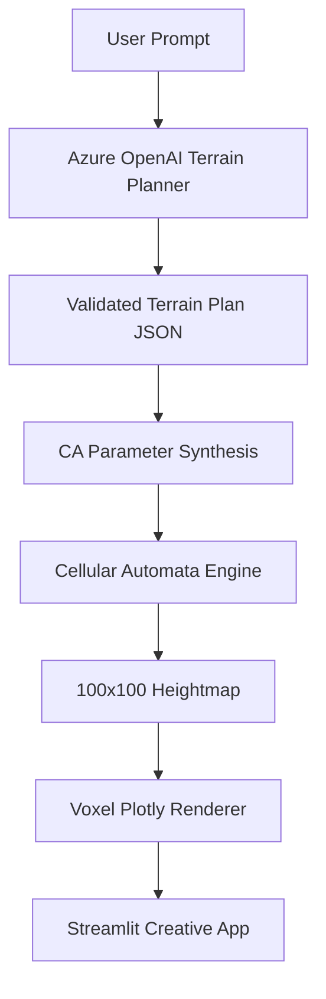

# terrCAIn

**AI-Powered Emergent Terrain Generation using Cellular Automata**

terrCAIn is a Microsoft AI-powered creative app built with Streamlit. It uses Azure OpenAI to translate natural-language terrain descriptions into Cellular Automata simulation parameters, evolves the landscape through local cell interactions, and renders the result as a voxel terrain where each visible column corresponds to one CA cell.

## Features

- Natural language terrain input
- Azure OpenAI terrain planning with JSON parameter validation and safe fallbacks
- Five terrain presets: Volcano, Island, Mountain Range, Canyon, Rolling Hills
- 100x100 cellular automata terrain generation
- Interactive Plotly voxel visualization with one block column per CA cell
- AI Terrain Planner reasoning panel
- Automatic terrain explanation panel

## Project Structure

```text
terrCAIn/
├── app.py
├── ai/
│   ├── explanation_generator.py
│   ├── prompt_parser.py
│   └── terrain_planner.py
├── assets/
├── core/
│   ├── ca_engine.py
│   ├── terrain_generator.py
│   └── terrain_presets.py
├── visualization/
│   └── plotly_terrain.py
├── README.md
└── requirements.txt
```

## Architecture



## Azure OpenAI Integration

The `ai/terrain_planner.py` module sends the user prompt to Azure OpenAI and asks the model to return only JSON with:

- `terrain_type`
- `iterations`
- `noise_level`
- `smoothing_factor`
- `peak_bias`
- `center_bias`
- `reasoning`

The app validates every returned field, clamps values to safe ranges, and falls back to deterministic defaults if the model output is invalid or Azure credentials are missing.

## Cellular Automata Pipeline

1. The user enters a terrain description such as `Generate a large volcanic island with steep cliffs`.
2. Azure OpenAI plans the terrain and returns CA-oriented parameters.
3. The planner maps those parameters onto the existing terrain preset architecture.
4. The CA engine evolves a `100x100` grid using Moore-neighborhood smoothing and bias masks.
5. The normalized heightmap is converted into block heights for voxel rendering.
6. The final terrain is shown as block columns so the underlying CA grid remains visible.

## Voxel Visualization

- Each CA cell becomes one `1x1` terrain column.
- Column height is derived from the cell value and quantized into visible voxel steps.
- Every column is rendered as a solid block prism anchored to the base plane.
- No smooth surface interpolation is used.
- Grid-aligned outlines make the CA structure easy to inspect visually.

## Running Locally

### 1. Create and activate a virtual environment

Windows PowerShell:

```powershell
python -m venv .venv
.venv\Scripts\Activate.ps1
```

### 2. Configure Azure OpenAI

```powershell
$env:AZURE_OPENAI_ENDPOINT="https://YOUR-RESOURCE-NAME.openai.azure.com"
$env:AZURE_OPENAI_API_KEY="YOUR_AZURE_OPENAI_KEY"
$env:AZURE_OPENAI_DEPLOYMENT="YOUR_MODEL_DEPLOYMENT_NAME"
```

### 3. Install dependencies

```powershell
pip install -r requirements.txt
```

### 4. Run the app

```powershell
streamlit run app.py
```

Then open the local URL shown by Streamlit in your browser.

## Planner Output Example

Example prompt:

```text
Generate a large volcanic island with steep cliffs
```

Example planner JSON:

```json
{
  "terrain_type": "volcano",
  "iterations": 50,
  "noise_level": 0.18,
  "smoothing_factor": 0.25,
  "peak_bias": 0.95,
  "center_bias": 0.90,
  "reasoning": [
    "Detected volcanic terrain.",
    "Increased central elevation.",
    "Reduced smoothing for sharper cliffs.",
    "Raised iteration count to deepen terrain evolution."
  ]
}
```

## Example Prompts

- `Generate a volcanic island`
- `Create rolling hills`
- `Generate a mountain range`
- `Create a canyon`

## Hackathon Notes

- The CA engine remains modular and deterministic for reproducible demos.
- The planner preserves the current architecture by synthesizing Azure-generated parameters into the existing preset pipeline.
- If Azure OpenAI is unavailable, terrCAIn still runs with safe default parameters so the demo remains usable.
