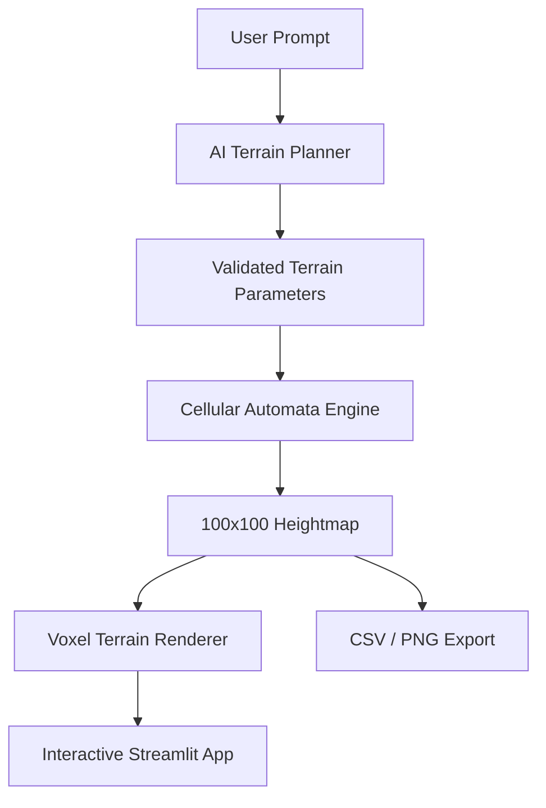

<p align="center">
  
</p>
<p align="center">
AI-Powered Emergent Terrain Generation using Cellular Automata
</p>

# Overview

terrCAIn is an AI-powered creative application built with Streamlit that transforms natural-language terrain descriptions into emergent voxel-based 3D landscapes. The system combines AI-assisted terrain planning with Cellular Automata simulation to generate explainable procedural terrains.

Users can describe landscapes in plain English, such as:

* Generate a volcanic island with steep cliffs
* Create rolling hills with gentle valleys
* Generate a rugged mountain range
* Create a deep canyon with sharp ridges

terrCAIn interprets the prompt, generates terrain parameters, evolves a Cellular Automata simulation, and visualizes the resulting landscape as an interactive voxel terrain.

The application supports Azure OpenAI integration when configured and automatically falls back to a built-in local terrain planner when cloud services are unavailable.

---

## Features

* Natural language terrain generation
* Local AI terrain planner
* Optional Azure OpenAI integration
* Five terrain types:

  * Volcano
  * Island
  * Mountain Range
  * Canyon
  * Rolling Hills
* 100×100 Cellular Automata terrain simulation
* Interactive voxel-based 3D visualization
* AI Terrain Planner reasoning panel
* Explainable terrain generation workflow
* CSV heightmap export
* PNG heightmap export

---

## Project Structure

```text
terrCAIn/
├── app.py
├── ai/
│   ├── explanation_generator.py
│   ├── prompt_parser.py
│   └── terrain_planner.py
├── assets/
├── core/
│   ├── ca_engine.py
│   ├── terrain_generator.py
│   └── terrain_presets.py
├── visualization/
│   ├── plotly_terrain.py
│   └── terrain_export.py
├── README.md
└── requirements.txt
```

---

## Architecture



---

## AI Terrain Planning

terrCAIn supports two planning modes:

### Local Terrain Planner

* Works without internet access or API keys
* Detects terrain types from natural-language prompts
* Generates Cellular Automata parameters and reasoning
* Provides fully offline functionality

### Azure OpenAI Planner

* Optional cloud-based AI planning
* Converts natural-language descriptions into terrain-generation parameters
* Automatically used when Azure credentials are configured

Both planning modes generate validated Cellular Automata parameters that drive terrain generation.

Generated parameters include:

* terrain_type
* iterations
* noise_level
* smoothing_factor
* peak_bias
* center_bias
* reasoning

---

## Cellular Automata Pipeline

1. The user enters a terrain description.
2. The AI Terrain Planner interprets the prompt.
3. Terrain-generation parameters are created and validated.
4. A 100×100 Cellular Automata grid evolves through neighborhood interactions.
5. A terrain heightmap emerges from the simulation.
6. The heightmap is converted into voxel terrain columns.
7. The terrain is rendered interactively.
8. Users can export generated terrains as CSV or PNG heightmaps.

---

## Example Terrain Types

### Volcano

* Strong central elevation
* High peak bias
* Steep slopes and volcanic formations

### Island

* Elevated center
* Lower surrounding edges
* Creates island-like terrain structures

### Mountain Range

* Multiple peaks and ridges
* High elevation variation
* Rugged terrain appearance

### Canyon

* Deep valleys and sharp ridges
* Strong terrain contrast
* Reduced smoothing

### Rolling Hills

* Gentle elevation changes
* Smooth terrain transitions
* Balanced terrain generation parameters

---

## Voxel Visualization

* Each Cellular Automata cell corresponds to one visible terrain column
* Each column occupies a 1×1 footprint on the terrain grid
* Column height is derived directly from the generated heightmap
* Every column grows from the base plane
* No smooth surface interpolation is used
* The underlying Cellular Automata structure remains visible

---

## Terrain Export

terrCAIn supports exporting generated terrains as:

### CSV Heightmaps

Stores the complete terrain heightmap as numerical data.

### PNG Heightmaps

Exports the terrain as a grayscale heightmap image suitable for visualization and further processing.

Exported terrains can be used in:

* Procedural generation workflows
* Simulations
* Research projects
* Terrain analysis pipelines
* Game-development workflows

---

## Running Locally

### 1. Create and activate a virtual environment

Windows PowerShell:

```powershell
python -m venv .venv
.venv\Scripts\Activate.ps1
```

### 2. Configure Azure OpenAI (Optional)

```powershell
$env:AZURE_OPENAI_ENDPOINT="https://YOUR-RESOURCE-NAME.openai.azure.com"
$env:AZURE_OPENAI_API_KEY="YOUR_AZURE_OPENAI_KEY"
$env:AZURE_OPENAI_DEPLOYMENT="YOUR_MODEL_DEPLOYMENT_NAME"
```

If Azure credentials are not provided, terrCAIn automatically uses the built-in local terrain planner.

### 3. Install dependencies

```powershell
pip install -r requirements.txt
```

### 4. Run the application

```powershell
streamlit run app.py
```

Then open the local URL shown by Streamlit in your browser.

---

## Example Prompts

* Generate a volcanic island with steep cliffs
* Create rolling hills with gentle valleys
* Generate a rugged mountain range
* Create a deep canyon with sharp ridges
* Generate a tropical island surrounded by water

---

## Hackathon Notes

* AI is used as a terrain-planning layer rather than directly generating geometry.
* Cellular Automata drive the actual terrain formation process.
* The system remains deterministic and reproducible.
* Azure OpenAI integration is supported but not required.
* Local AI planning guarantees offline functionality.
* Terrain export improves interoperability with external tools and workflows.
* Each visible voxel column directly corresponds to a Cellular Automata cell, preserving explainability and transparency of the simulation.
